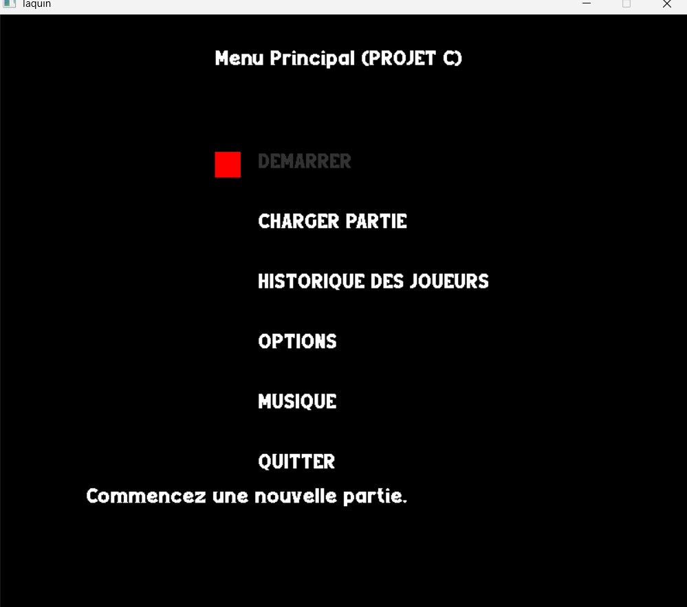
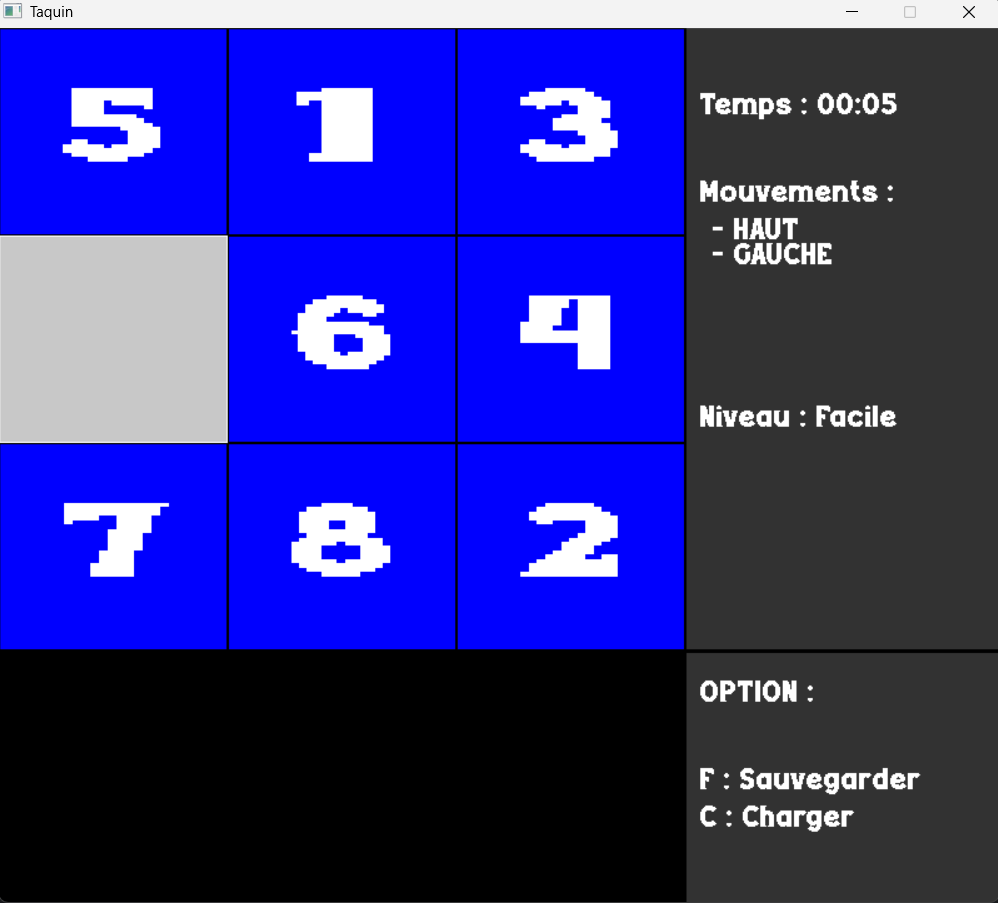

# 🎮 Jeu de Taquin en C avec SDL

Ce projet est un **jeu de taquin** (puzzle à glisser) développé en **langage C**, avec une interface graphique construite à l'aide de la bibliothèque **SDL2**.

---

## 📌 Présentation

Le jeu de taquin est un puzzle classique de type 3x3 ou 4x4, où le joueur doit remettre les tuiles dans l'ordre en les faisant glisser une par une.

Ce projet est à but pédagogique et a été réalisé dans le cadre de ma formation en informatique.





---

## 🛠️ Technologies utilisées

- **Langage C**
- **SDL2** (Simple DirectMedia Layer)
- SDL_image (pour charger les images)
- SDL_ttf (pour le texte, si utilisé)

---

## 🚀 Installation et exécution

### 1. Prérequis

Assurez-vous d’avoir les bibliothèques SDL2 installées :

#### Sur Ubuntu/Debian :
```bash
sudo apt update
sudo apt install libsdl2-dev libsdl2-image-dev libsdl2-ttf-dev
